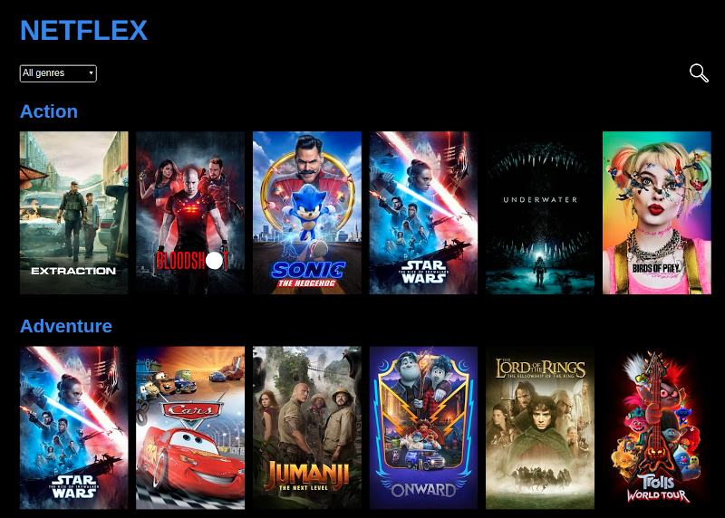

# NETFLEX - A Simple Movie Database API Implementation



## Intro

Provides movies information from 'The Movie DB' 
https://developers.themoviedb.org/

## Features

- Gets 20 movies for each movie genre 
- Clicking on a movie provides basic info
- Filterable by genre
- Any movie can be searched in the search bar

 

## API Issues

Fetching from the frontend was not always working, sometimes it did, sometimes not. The reason is that the 'Access-Control-Allow-Origin' was not always being included in the Response:

```
No 'Access-Control-Allow-Origin' header is present on the requested resource.
```

So I shifted to calling the api from the Node backend server and make data available to frontend via endpoints.


## Improvements

- Not enough time to trim off unnescessary data received from the api. The function in '/backend/trim-movies-data' is supposed to do this.
- Horizontal scrolling on desktop needs tweaking. Scrolling might end up taking the user to the movie details page.
